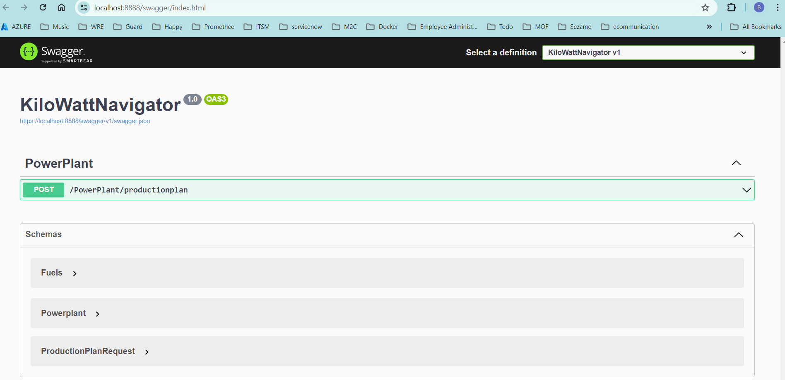
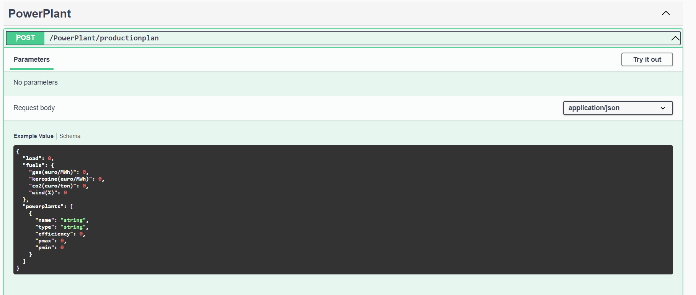
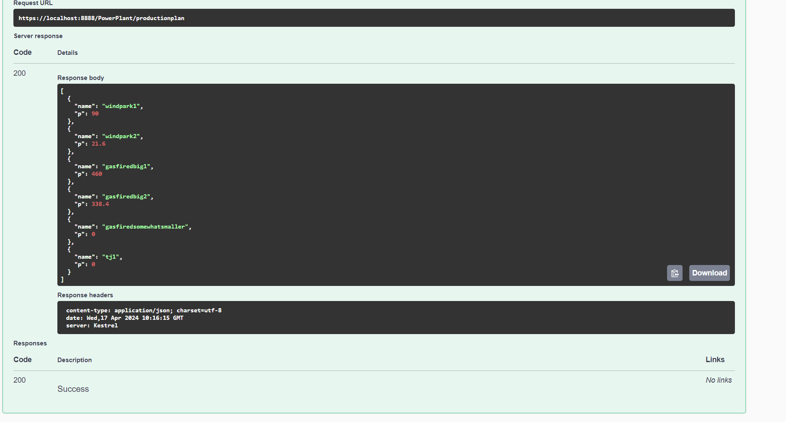
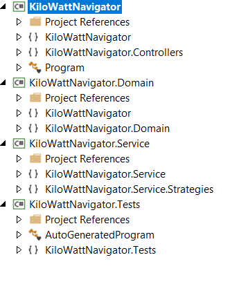
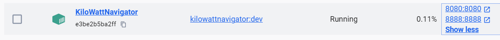

# Overview
The KiloWattNavigator API calculates how much power each of a multitude of different power plants needs to produce based on the given load. It takes into account the cost of underlying energy sources (such as gas and kerosene) and the Pmin and Pmax of each power plant.

## Key Concepts
Load Forecasting: The total load at each moment in time is forecasted. For example, in Belgium, you can find the load forecasted by the grid operator here.
Cost Considerations:
Gas-fired power plants are cheaper to operate due to lower gas costs compared to kerosene. Their thermal efficiency is around 50%, meaning 2 units of gas generate 1 unit of electricity.
Turbojets running on kerosene have higher production costs and lower efficiency (around 30%).
Windmills have zero production cost.
Merit-Order Decision:
Activating power plants depends on the merit-order. We prioritize cheaper options first.
The unit-commitment problem involves deciding which power plants to activate.

### Solution
This project contains different layers:

API: KiloWattNavigator
ServiceLayer: KiloWattNavigator.Service
DomainLayer: KiloWattNavigator.Domain

UnitTest: KiloWattNavigator.Tests

### Requirements

.Net8 SDK
.NET Core
XUnit 2.5.3
NSubstitute 5.1.0
Visual Studio 17.10 or later
Docker Desktop 

### Getting Started

1. Clone this repository.
2. Open the solution in Visual Studio or your preferred IDE.
3. Build the project to restore NuGet packages.
4. Expose an API endpoint (e.g., /productionplan) that accepts a POST request with the payload structure defined in the example_payloads directory.
5. Build of the solution a docker image is build and deployed in docker for testing, 
6. Set the run to Container (Dockerfile)

### TODO
1. the docker file can be used later for CI/CD intergration to build the image and put it in a Harbor source registry to host on Kubernetees for example
2. Unit test different layers, only the main project is partially tested
3. Integrate strategy pattern to decide which powerplant to activate

### Launch
The api will be accessible via swagger page or postman on port 8888
It can run in a Docker Container on port 8888, for more info check the dockerFile

### Usage
Send a POST request to https://localhost:8888/PowerPlant/productionplan with the load data.
Receive the calculated production plan in the response.

### Architecture

### Infrastructure

## Contact

Bert Helsen 
bert.helsen@engie.com

